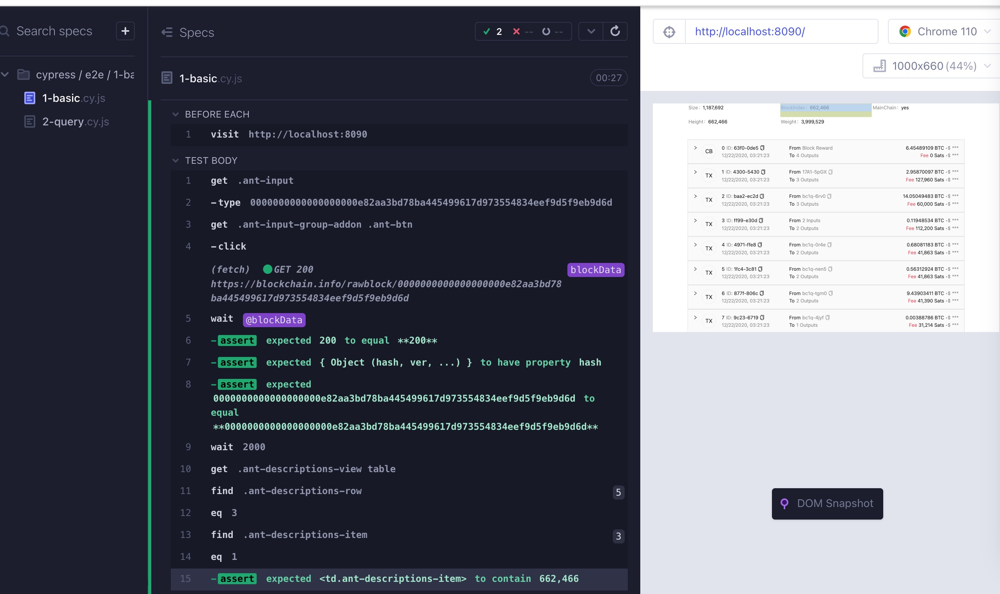

# 获取区块信息
```shell
# 启动前端服务
yarn dev

# 启动e2e测试
yarn cypress
```

服务启动之后访问：
- 直接访问：http://localhost:8090
- 带参数访问：http://localhost:8090/?hash=0000000000000000000ef9c073beedafb33a4f1874b80ac16500516e782f5b85

> query中的hash为区块链中的hash值（https://www.blockchain.com/explorer/blocks/btc/662464）

demo case


cypress case
